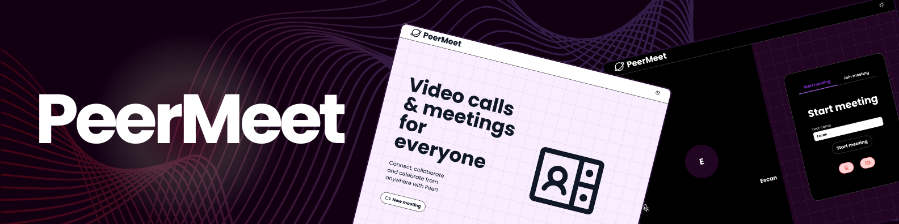

# 🎥 PeerMeet

<div align="center">
  <a href="https://peermeet.example.com" target="_blank" rel="noopener noreferrer">
    
  </a>

  <p>A clean, performant WebRTC video calling frontend built with React + TypeScript.</p>

  <div>
    
    
    
    
  </div>
</div>

---

## 🧠 About the Project

PeerMeet is a **WebRTC frontend application for video calling**, designed as a Single Page Application (SPA) with React and TypeScript.

The focus is on **clean architecture, performance, and a smooth user experience** without relying on any backend or signaling server implementation. It demonstrates proficiency in WebRTC, React hooks, state management, and real-time UI updates.

---

## ✨ Features

-   🎥 **Video Calling with WebRTC**

    -   Peer-to-peer video and audio streaming using `simple-peer`.
    -   Support for local and remote video streams.
    -   Dynamic UI updates on connection status.

-   🔄 **Real-time State Management**

    -   Uses React Context and Redux Toolkit for managing call state.
    -   Efficient event handling and UI synchronization.

-   🧩 **Clean Component Architecture**

    -   Modular React components with separation of concerns.
    -   Custom hooks for WebRTC and media stream logic.

-   ⚙️ **Performance Optimizations**

    -   Lazy loading components with React `Suspense`.
    -   Memoization using `React.memo` and hooks like `useCallback` and `useMemo`.
    -   Optimized bundle with Vite.

-   📱 **Responsive UI**

    -   Mobile-first design with Tailwind CSS.
    -   Accessible controls for muting, ending calls, and toggling video.

-   🧪 **Testing & Type Safety**

    -   Written fully in **TypeScript**.
    -   Unit tests with **Vitest** covering key components and hooks.
    -   ESLint and Prettier for code quality.

---

## 🔧 Technologies

-   **React** + **React Router DOM**
-   **TypeScript**
-   **Vite** for fast development and build
-   **Redux Toolkit** for state management
-   **Tailwind CSS** for styling
-   **Simple-Peer** for WebRTC abstraction
-   **Vitest** for testing

---

## 🚀 Getting Started

### 1. Clone the repository

```bash
git clone https://github.com/atzin-escandia/peermeet
cd peermeet
```

### 2. Install dependencies

```bash
yarn install
```

### 3. Run the development server

```bash
yarn dev
```

### 4. Build for production

```bash
yarn build
```

### 5. Preview production build

```bash
yarn preview
```

---

## 🧪 Testing

Run tests with:

```bash
yarn test
```

---

## 📈 Performance Strategy

To achieve smooth video calling and efficient UI updates:

-   Minimal external dependencies beyond `simple-peer`.
-   React memoization (`memo`, `useCallback`, `useMemo`) to prevent unnecessary renders.
-   Lazy loading of non-critical components with `Suspense`.
-   Clean separation of UI and WebRTC signaling/state logic.
-   Optimized build with Vite for fast load and bundle size.

---

## 🧱 Design Decisions

-   SPA with React Router for smooth navigation between call and setup screens.
-   Redux Toolkit for predictable state management and ease of debugging.
-   Tailwind CSS for rapid and responsive UI styling.
-   Custom hooks to encapsulate WebRTC peer connection and media stream handling.
-   TypeScript for type safety across components and hooks.

---

## 📚 Resources

-   [WebRTC API Docs](https://developer.mozilla.org/en-US/docs/Web/API/WebRTC_API)
-   [Simple-Peer GitHub](https://github.com/feross/simple-peer)
-   [React Docs](https://react.dev/)
-   [Redux Toolkit Docs](https://redux-toolkit.js.org/)
-   [Tailwind CSS Docs](https://tailwindcss.com/docs)

---

## Made with ❤️ by [Atzin Escandia](https://theplumup.com/)
